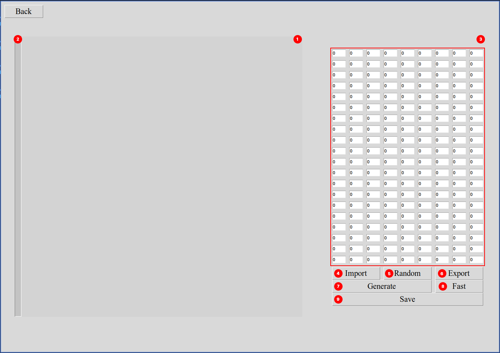
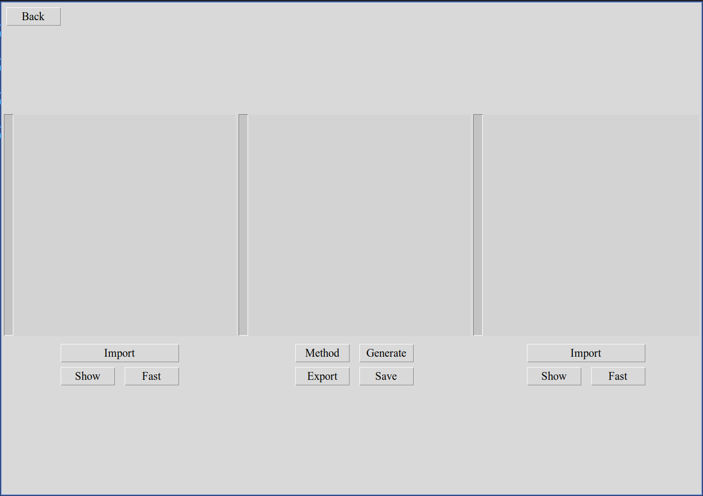

</img>

<div align="center" width="128">
  <a href="./README.md" align="left" style="padding: 5px;"> 🇺🇸ENG </a><a href="./README.ua.md" align="right" style="padding: 5px;"> 🇺🇦UKR </a>
</div>

___

<!-- TOC start (generated with https://github.com/derlin/bitdowntoc) -->

# Навігація

- [🔎 Про проєкт](#about)
- [🚀 Як запустити?](#how-to-run)
   * [Залежності](#dependencies)
   * [Poetry](#poetry)
   * [Windows](#windows)
   * [Linux / MacOs](#linux-macos)
- [🔥 Як використовувати?](#hot-to-usage)
  * [Generate Plant](#generate-plant)
  * [Smash Plants](#smash-plants)
  * [Mass Smash](#mass-smash)
- [🏞️ Галерея](#gallery)
- [📃 Ліцензія](#license)
- [💻 Розробники](#developers)

<!-- TOC end -->

___
<!-- TOC --><a name="about"></a>
# 🔎 Про проєкт

**DigitalGarden** — це проєкт для генерації цифрових рослин за допомогою агентів що малюють кола. 
Окрім генерування власних рослин за геномом ви, також, можете схрещувати раніше згенеровані рослини декількома способами,
після чого зберігати їх та ділитися своїми результатами.

___

<!-- toc --><a name="how-to-run"></a>
# 🚀 Як запустити?

<!-- toc --><a name="dependencies"></a>
## Залежності
- 🐍 `python >= 3.11`: мова програмування 
- 🖼️ `Pillow >= 10.3.0`: використовується для малювання рослин
- 🪴 `plant_generator`: використовується для генерації рослин
- 🛠️ `tools`: допоміжні інструменти

Перш за все клонуйте код проєкту та перейдіть в теку з кодом:
```bash
$ git clone https://github.com/codemorphist/DigitalGarden.git --depth 1
$ cd DigitalGarden
```

Дійте далі відповідно до того яку операційну систему та менеджер пакетів ви використовуєте

<!-- TOC --><a name="poetry"></a>
## Poetry

Проєкт використовує менеджер пакетів та залежностей [Poetry](https://python-poetry.org/), 
тому якщо ви хочете швидко запустити код (незалежно від того, яку операційну систему ви використовуєте) можете встановити **Poetry** і виконати наступні команди:

Встановіть залежності:
```bash
$ poetry install
```

Запустіть проєкт:
```bash
$ poetry run python app
```

<!-- toc --><a name="windows"></a>
## Windows

### pip

Створіть нове віртуальне середовище та встановіть залежності:
```bash
$ python -m venv venv
$ .\venv\Scripts\activate
$ pip install -r requirements.txt
```

Запустіть проєкт:
```bash
$ python app
```

### conda

Якщо ви використовуєте **conda** створіть віртуальне середовище та активуйте його: 

```bash
$ conda env create -f environment.yml
$ conda activate digitalgarden
```

Запустіть проєкт:

```bash
$ python app
```

<!-- TOC --><a name="linux-macos"></a>
## Linux / MacOS

### pip

Якщо ви використовуєте **pip**

Створіть нове віртуальне середовище та встановіть залежності:
```bash
$ python -m venv venv
$ source venv/bin/activate
$ pip install -r requirements.txt
```

Запустіть проєкт:
```bash
$ python app
```

### conda

Якщо ви використовуєте **conda** створіть віртуальне середовище та активуйте його: 

```bash
$ conda env create -f environment.yml
$ conda activate digitalgarden
```

Запустіть проєкт:

```bash
$ python app
```

<!-- TOC --><a name="how-to-usage"></a>
# 🔥 Як використовувати?

В цій секції ви можете знайти детальну інформацію як генерувати рослини, схрещувати та зберігати їх в окремі файли.


<!-- TOC --><a name="generate-plant"></a>
<details>

<summary>Generate Plant</summary>



1. Канвас, тут буде відображатися згенерована рослина
2. Прогрес бар, показує на скільки згенерована рослина в поточний момент
3. Таблиця з геномом
4. Кнопка імпортування, імпортує геном у файл
5. Кнопка для генерації випадкового геному
6. Кнопка експортування, експортує геном з файлу
7. Кнопка для генерації рослини з анімацією
8. Кнопка для швидкої генерації рослини
9. Кнопка для збереження зображення рослини

</details>

<!-- TOC --><a name="Smash Plants"></a>
<details>

<summary>Smash Plants</summary>



1. Канвас з прогрес баром де буде відображатися генерація першого предку 
2. Канвас з прогрес баром де буде відображатися генерація нащадка
3. Канвас з прогрес баром де буде відображатися генерація другого предка
4. Кнопка для імпортування геному предка
5. Кнопка для генерації предка з анімацією
6. Кнопка для швидкої генерації предка
7. Кнопка для вибору метода схрещування
8. Кнопка для генерації нащадка
9. Кнопка для експортування геному нащадка 
10. Кнопка для збереження зображення нащадка

</details>

<!-- TOC --><a name="Mass Smash"></a>
<details>

<summary>Mass Smash</summary>


1. Канвас з прогрес баром де буде відображатися генерація нащадка
2. Список з геномами предків
3. Кнопка що зміщує виділеного предка вверх на одну позицію
4. Кнопка що зміщує виділеного предка вниз на одну позицію
5. Кнопка для додавання геному ще одного предка
6. Кнопка для видалення виділеного предка
7. Кнопка для вибору метода схрещування
8. Кнопка для генерації нащадка
9. Кнопка для швидкої генерації нащадка
10. Кнопка для експортування отриманого геному нащадка
11. Кнопка для збереження зображення нащадка 

</details>


<!-- TOC --><a name="gallery"></a>
# 🏞️ Галерея

Галерея з рослинами доступна за посиланням: [Gallery](https://codemorph.xyz/DigitalGarden/)

<!-- toc --><a name="license"></a>
# 📃 Ліцензія 

</img>
Код проєкту поширюється під ліцензією **GNU General Public License v3.0**
<br>
Детальніше ознайомитися з текстом ліцензії можна тут: [LICENCE](./LICENSE)

<!-- TOC --><a name="developers"></a>
# 💻 Розробники

|  |  |
|--|--|
| Alex Katrenko <br> [@codemorphist](https://www.github.com/codemorphist) | Illia Karbyshev <br> [@karbyshevillia](https://www.github.com/karbyshevillia) |

