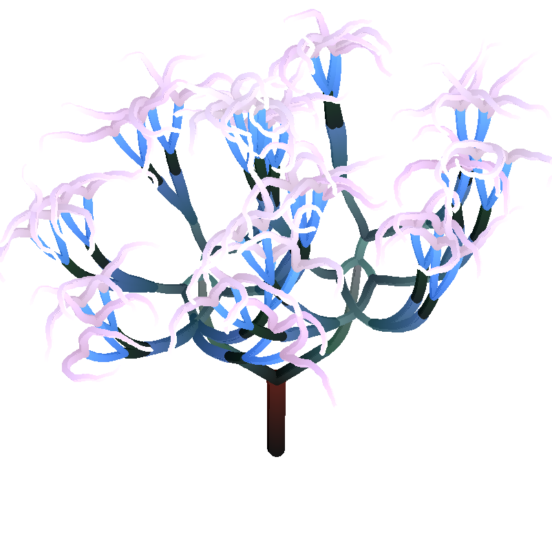
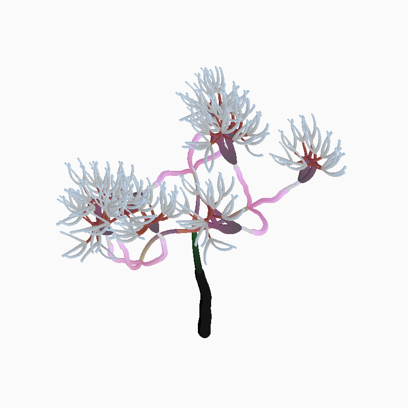
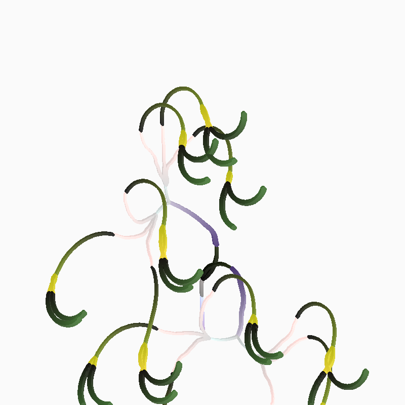
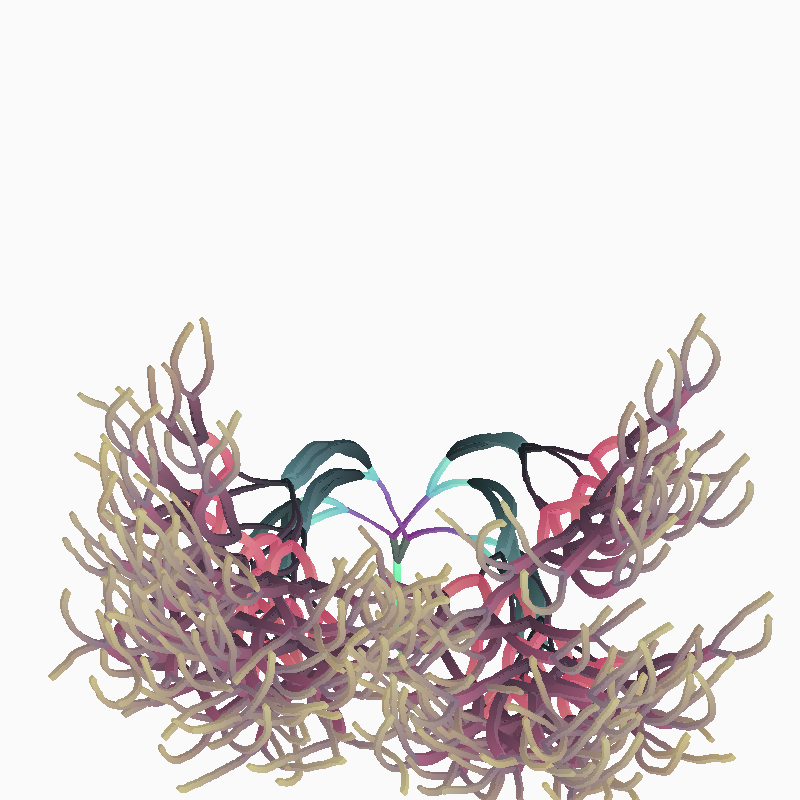
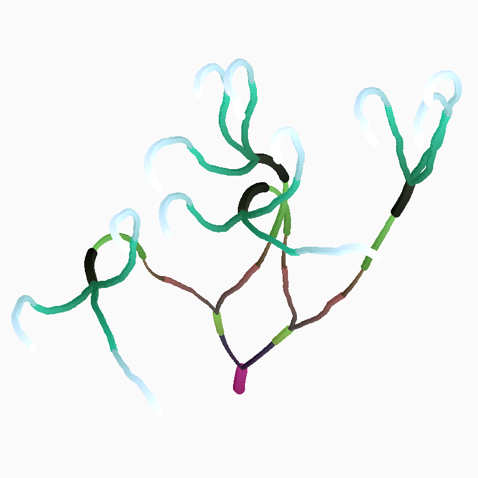
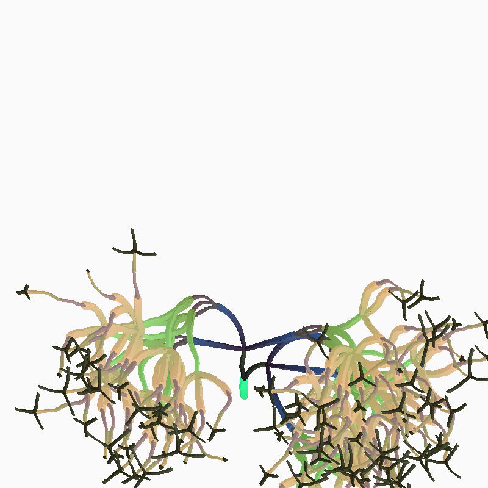
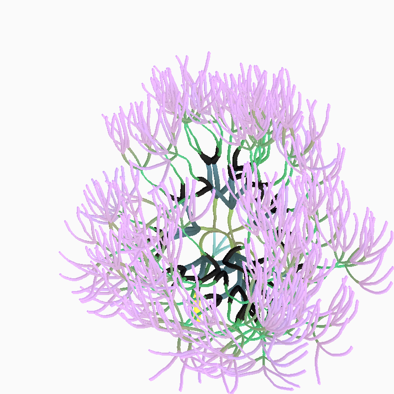

</img>

___

<!-- TOC start (generated with https://github.com/derlin/bitdowntoc) -->

# Навігація

- [Про проект](#about)
- [Як запустити?](#how-to-run)
   * [Залежності](#dependencies)
   * [Poetry](#poetry)
   * [Windows](#windows)
   * [Linux / MacOs](#linux-macos)
- [Як використовувати?](#hot-to-usage)
  * [Generate Plant](#generate-plant)
  * [Smash Plants](#smash-plants)
  * [Mass Smash](#mass-smash)
- [Галерея](#gallery)
- [Ліцензія](#license)
- [Розробники](#developers)

<!-- TOC end -->

<!-- TOC --><a name="about"></a>
# Про проект

**DigitalGarden** це поект генерації цифрових рослин за допомогою агентів що малють кола. 
Окрім генерування власних рослин за геномом ви можете схрещувати раніше згенеровані рослини декількома способами.


<!-- toc --><a name="how-to-run"></a>
# Як запустити?


<!-- toc --><a name="dependencies"></a>
## Залежності
- `Python >= 3.11`
- `Pillow >= 10.3.0`
- `plant_generator`
- `tools`

<!-- TOC --><a name="poetry"></a>
## Poetry

Проект використовує менеджер пакетів та залежностей [Poetry](https://python-poetry.org/), 
тому якщо ви хочете швидко запустити проект (в незалежності від того, яку операційну систему ви використовуєте) можете втановити **Poetry** і виконати наступні команди:

### Клонування проєкту та встановлення залежностей

```bash
git clone https://github.com/codemorphist/DigitalGarden.git
cd DigitalGarden
poetry install
```

### Запуск

```bash
poetry run python app
```

<!-- toc --><a name="windows"></a>
## Windows

### pip
Клонуйте репозиторій та перейдіть в папку репозиторія.
```bash
git clone https://github.com/codemorphist/DigitalGarden.git
cd DigitalGarden
```

Створіть нове віртуальне середовище та встановіть залежності
```bash
python -m venv venv
pip install -r requirements.txt
```

Запустіть проєкт
```bash
python app
```

<!-- TOC --><a name="linux-macos"></a>
## Linux / MacOs

### pip
Клонуйте репозиторій та перейдіть в папку репозиторія.
```bash
git clone https://github.com/codemorphist/DigitalGarden.git
cd DigitalGarden
```

Створіть нове віртуальне середовище та встановіть залежності
```bash
python -m venv venv
pip install -r requirements.txt
```

Запустіть проєкт
```bash
python app
```

<!-- toc --><a name="how-to-usage"></a>
# Як використовувати?

В цій секції ви можете знайти детальну інформацію як генерувати рослини, схрещувати та зберігати.

<!-- toc --><a name="generate-plant"></a>
## Generate Plant

...

<!-- toc --><a name="Smash Plants"></a>
## Smash Plants 

...

<!-- toc --><a name="Mass Smash"></a>
## Mass Smash

...

<!-- TOC --><a name="gallery"></a>
# Галерея

|  |  |
|--|--|
| [blues.txt](./orangery/blues.txt) | [coral_palm.txt](./orangery/coral_palm.txt) |

|  |  |
|--|--|
| [exotic.txt](./orangery/exotic.txt) | [fire_palm.txt](./orangery/fire_palm.txt) |

|  |  |
|--|--|
| [luminosity.txt](./orangery/luminosity.txt) | [orange_tree.txt](./orangery/orange_tree.txt) |

|  |  |
|--|--|
| [purple_tree.txt](./orangery/purple_tree.txt) | [violet.txt](./orangery/violet.txt) |

<!-- toc --><a name="license"></a>
# Ліцензія 

</img>
Код проекту поширюється під ліцензією **GNU General Public License v3.0**
<br>
Детальніше ознайомитися з ліцензією можна тут: [LICENCE](./LICENSE)

<!-- TOC --><a name="developers"></a>
# Розробники

|  |  |
|--|--|
| Alex Katrenko <br> [@codemorphist](https://www.github.com/codemorphist) | Illia Karbyshev <br> [@karbyshevillia](https://www.github.com/karbyshevillia) |

