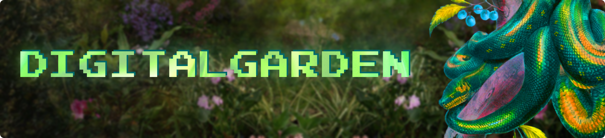

</img>

___

<!-- TOC start (generated with https://github.com/derlin/bitdowntoc) -->

# Навігація

- [Про проект](#about)
- [Як запустити?](#how-to-run)
   * [Poetry](#poetry)
   * [Windows](#windows)
   * [Linux / MacOs](#linux-macos)
- [Галерея](#gallery)
- [Розробники](#developers)

<!-- TOC end -->

<!-- TOC --><a name="about"></a>
# Про проект

...


<!-- TOC --><a name="how-to-run"></a>
# Як запустити?

<!-- TOC --><a name="poetry"></a>
## Poetry

Проект використовує менеджер пакетів та залежностей [Poetry](https://python-poetry.org/), 
тому якщо ви хочете швидко запустити проект можете втановити **Poetry** і виконати наступні команди:

### Клонування проєкту та встановлення залежностей

```bash
git clone https://github.com/codemorphist/DigitalGarden.git
cd DigitalGarden
poetry install
```

### Запуск

```
poetry run python app
```

<!-- TOC --><a name="windows"></a>
## Windows

### pip

...


<!-- TOC --><a name="linux-macos"></a>
## Linux / MacOs

### pip

...


<!-- TOC --><a name="gallery"></a>
# Галерея

|  |  |
|--|--|
| [blues.txt](,/orangery/blues.txt) | [coral_palm.txt](./orangery/coral_palm.txt) |

<!-- TOC --><a name="developers"></a>
# Розробники

|  |  |
|--|--|
| Alex Katrenko <br> [@codemorphist](https://www.github.com/codemorphist) | Illia Karbyshev <br> [@karbyshevillia](https://www.github.com/karbyshevillia) |

